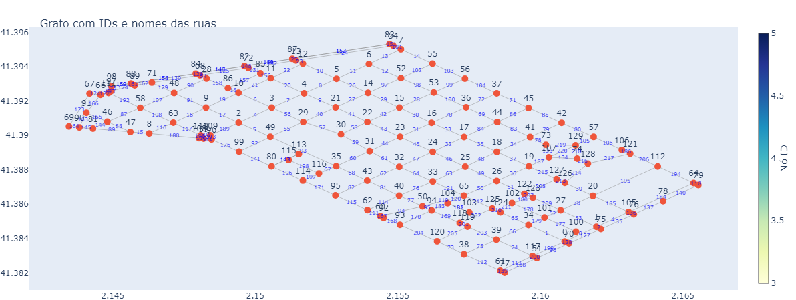

# Trabalho de Projeto e Análise em Algoritmos
Repositório destinado ao trabalho relacionado a A2 da disciplina de Projeto e Análise de Algorítimos.

[Descrição do Trabalho](./data/descricao-trabalho.pdf)

# Modo de usar:

Para exemplificar o problema em um caso real, usamos como base o bairro L'Esquerra de l'Eixample de Barcelona, a forma de coleta pode ser encontrada em [Coleta do bairro](./data/create_mapa.ipynb), deste modo, para executar, primeiro, observe o mapa a seguir, o número do vértice de partida e o número do vértice de destino:



Após selecionado, deverá ser executado o seguinte comando:

```bash
$ g++ main.cpp -o main.out && ./main.out
```

Assim, o usuário deverá inserir os dois vértices conforme solicitado, além de sua verba, e o algoritmo retornará o caminho percorrido, em junção com o meio de locomoção.


# Módulos:

## Algoritmos.cpp/.h

Ambos são os módulos das implementações finais dos algoritmos,tarefa 1 temos o subway, tarefa 2 temos o bus, e, tarefa 3 temos o melhorRota, que basicamente executa dijkstra_custo.

## AlgoritmosBase.cpp/.h

Módulo para a implementação 

